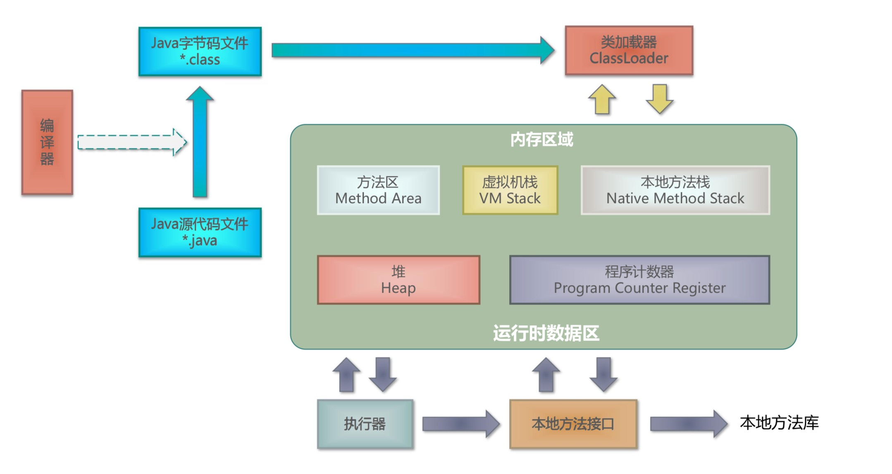

程序计数器时一块较小的内存空间，它可以是当前线程所执行的字节码的行号指示器.在虚拟机的概念模型中（不同的虚拟机可能实现不同）字节码解释器工作时就是通过改变这个计数器的值来选取下一条需要执行的字节码指令，分支、循环、跳转、异常处理、线程恢复等基础功能都需要依赖这个计数器来完成。

由于Java虚拟机的多线程是通过线程轮流切换并分配处理器执行时间的方式来实现的，在任何一个确定的时间，一个处理器（对于多核处理器来说是一个内核）都只会执行一条线程中的指令。因此，为了线程切换后能恢复到正确的执行位置，每条线程都需要一个独立的程序计数器，各条线程之间计数器互不影响，独立存储，我们称这类内存区域为==线程私有==的内存

> 此内存区域是唯一没有规定任何OutOfMemoryError情况等区域

