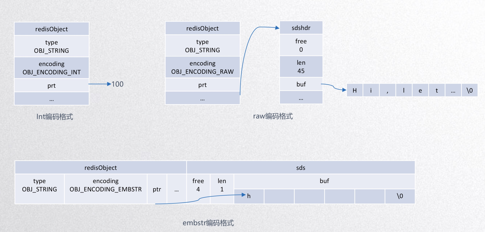
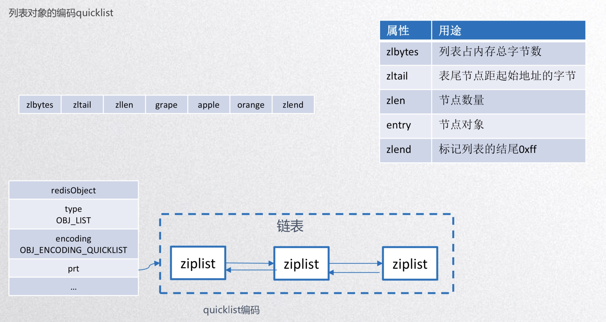
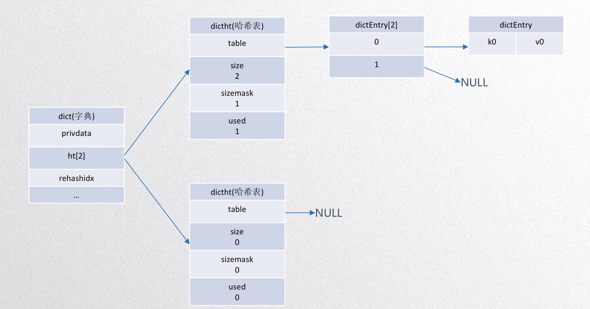
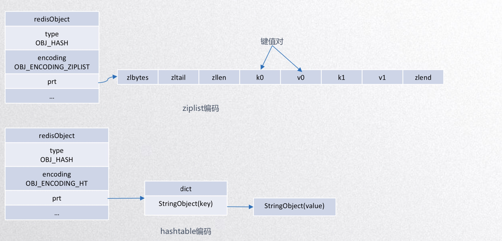

# [Redis详解（三）------ redis的五大数据类型详细用法](https://www.cnblogs.com/ysocean/p/9080940.html)


# 目录

1. 字符串（string）
2. 列表（List）
3. Set（集合）
4. Hash（哈希）
5. Sorted Set（有序集合）
6. 系统相关命令
7. key相关命令

## 1. String数据类型
string 是Redis的最基本的数据类型，可以理解为与 Memcached 一模一样的类型，一个key 对应一个 value。string 类型是二进制安全的，意思是 Redis 的 string 可以包含任何数据，比如图片或者序列化的对象，一个 redis 中字符串 value 最多可以是 512M。

Redis使用对象表示数据库中的键值，每当在Redis的数据库中创建一个键值对时，将会创建两个对象即键对象和值对象


**RedisObject结构**

```

typedef struct redisObject { 
    //对象的数据类型，占4bits，共5种类型 
    unsigned type:4; 
    //对象的编码类型，占4bits，共10种类型 
    unsigned encoding:4;
    //least recently used 
    //实用LRU算法计算相对server.lruclock的LRU时间 
    unsigned lru:LRU_BITS;
    //引用计数
    int refcount;
    //指向底层数据实现的指针
    void *ptr;
 } robj;

```


## 类型与编码

| 类型       | 编码                   | 对象                     |
| ---------- | ---------------------- | ------------------------ |
| OBJ_STRING | OBJ_ENCODING_INT       | 整数值类型的字符串       |
| OBJ_STRING | OBJ_ENCODING_EMBSTR    | EMBSTR字符串对象         |
| OBJ_STRING | OBJ_ENCODING_RAW       | 动态字符串对象           |
| OBJ_LIST   | OBJ_ENCODING_QUICKLIST | 快速列表实现的列表对象   |
| OBJ_HASH   | OBJ_ENCODING_ZIPLIST   | 压缩表实现的哈希对象     |
| OBJ_HASH   | OBJ_ENCODING_HT        | 字典实现的哈希对象       |
| OBJ_SET    | OBJ_ENCODING_INTSET    | 整数集合实现的集合对象   |
| OBJ_SET    | OBJ_ENCODING_HT        | 字典实现的集合对象       |
| OBJ_ZSET   | OBJ_ENCODING_ZIPLIST   | 压缩表实现的有序集合对象 |
| OBJ_ZSET   | OBJ_ENCODING_SKIPLIST  | 跳跃表实现的有序集合对象 |

## 适配规则

| 类型       | 一般情况                              | 少量数据 | 特殊情况 |
| ---------- | ------------------------------------- | -------- | -------- |
| String     | RAW                                   | EMBSTR   | INT      |
| List       | QUICKLIST(>=3.2.0) LINKEDLIST(<3.2.0) | ZIPLIST  |          |
| Set        | HT                                    |          | INTSET   |
| Hash       | HT                                    | ZIPLIST  |          |
| Sorted Set | SKIPLIST                              | ZIPLIST  |          |
**作用:**通过设置encoding属性来设定对象所使用的编码，而不是为特定对象关联一种固定的编码，极大提升了Redis的灵活性和效 率,因为Redis可以根据不同的使用场景来为一个对象设置不同的编码，从而优化对象在某一个场景下的效率

## String
```c
struct sds {
    //buf中已占用空间的长度 
    unsigned int len;
    //内存大小 
    unsigned int alloc;
    //特殊标识位 
    unsigned char flags;
    //初始化sds分配的数据空间 
}; 
```

**扩容策略**:
字符串在长度小于 1M 之前，扩容空间采用加倍策略，也就是保留 100% 的冗余空间。当长度超过 1M 之后，为了避免加倍后的冗余空间过大而导致浪费，每次扩容只会多分配 1M 大小的冗余空间

> redis 0-9999数字为共享数据

### 1. String编码格式


### 2. 编码转换
编码|值
---|---
INT|可以用long类型保存的整数
EMBSTR|可以用long double类型保存的浮点数、字符长度<=44
RAW|长度太大无法用long类型表示的整数、长度太长无法用long double表示的浮点型 字符长度>44
### EMBSTR VS RAW

1. embstr编码将创建字符串对象所需的内存分配次数从raw编码的两次降低为一次
2.  释放embstr编码的字符串对象只需要调用一次内存释放函数，而释放raw编码字符串对象需要调用两次内存释放函数
3. embstr编码的字符串对象的所有数据都保存在一块连续的内存例，所以能更好地利用缓存带来的优势

## 2. List
列表对象的编码quicklist:


- list-max-ziplist-size参数的含义解释，取正值时表示quicklist节点ziplist包含的数据项。取负值表示按照占用字节来限定 :

  quicklist节点ziplist的长度。 

   	- -5: 每个quicklist节点上的ziplist大小不能超过64 Kb。
    - -4: 每个quicklist节点上的ziplist大小不能超过32 Kb。
    - -3: 每个quicklist节点上的ziplist大小不能超过16 Kb。
    - -2: 每个quicklist节点上的ziplist大小不能超过8 Kb。(默认值) -1: 每个quicklist节点上的ziplist大小不能超过4 Kb。 

- list-compress-depth，list设计最容易被访问的是列表两端的数据，中间的访问频率很低，如果符合这个场景，list还有一 个配置，可以对中间节点进行压缩(采用的LZF——一种无损压缩算法)，进一步节省内存。

	- 0: 是个特殊值，表示都不压缩。(默认值)

	- 1: 表示quicklist两端各有1个节点不压缩，中间的节点压缩。 2: 表示quicklist两端各有2个节点不压缩，中间的节点压缩

## 3. Hash对象

```C
//字典
typedef struct dict {
	//类型特定函数 
	dictType *type; 
	//私有数据 
	void *privdata; 
	//哈希表
	dictht ht[2];
	//rehash 索引
	//当 rehash 不在进行时，值为 -1
	int rehashidx;
	//目前正在运行的安全迭代器的数量 int iterators;
} dict;

//哈希表
typedef struct dictht {
	//哈希表数组 
	//数组的每个项是entry链表的头结点(链地址法解决哈希冲突)
	dictEntry **table;
	// 哈希表大小 
	unsigned long size;
	//哈希表大小掩码，用于计算索引值
	//总是等于 size - 1 unsigned long sizemask;
	// 该哈希表已有节点的数量 
	unsigned long used;
} dictht;

//哈希表节点
typedef struct dictEntry {
	//键 
	void *key; 
	//值
	union {
		void *val; 
		uint64_t u64; 
		int64_t s64;
	} v;
	// 指向下个哈希表节点，形成链表
	struct dictEntry *next; 
} dictEntry;
```
字典结构图：

哈希对象的编码可以时ziplist或者hashtable
