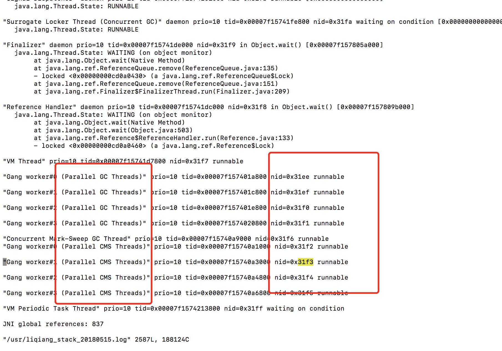

# JVM中消耗CPU最多的java线程
1. top找出cpu最大进程

2. 找出高cpu线程 `top -Hp <pid>` 查看进程中线程cpu消耗情况
3. 线程ID转化为十六进制：`printf %x pid`
4. jstack pid > xx.log
5. 分析xx.log文件



```
ps -mp pid -o THREAD,tid,time # 打印出该进程下的线程占用cpu情况
printf "%x\n" tid   #将需要的线程ID转换为16进制格式

jstack pid |grep tid -A 30      #打印线程的堆栈信息

jmap -histo 31641 | jmap -histo:live 31641 > a.txt      #打印类占用大小
```