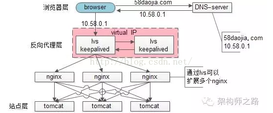

拓展：
[lvs为何不能完全替代DNS轮询](https://blog.csdn.net/fhzh520/article/details/52596277)
[DNS轮询做法](https://blog.csdn.net/s277955712/article/details/51273146)
部分同学持这样的观点：
1. nginx前端加入lvs和keepalived可以替代“DNS轮询”

2. F5能搞定接入层高可用、扩展性、负载均衡，可以替代“DNS轮询”
  “DNS轮询”究竟是不是过时的技术，是不是可以被其他方案替代，接入层架构技术演进，是本文将要细致讨论的内容。

## 一、问题域
  nginx、lvs、keepalived、f5、DNS轮询，每每提到这些技术，往往讨论的是接入层的这样几个问题：
  1）可用性：任何一台机器挂了，服务受不受影响
  2）扩展性：能否通过增加机器，扩充系统的性能
  3）反向代理+负载均衡：请求是否均匀分摊到后端的操作单元执行

## 二、上面那些名词都是干嘛的
1. nginx：一个高性能的web-server和实施反向代理的软件
2. lvs：Linux Virtual Server，使用集群技术，实现在linux操作系统层面的一个高性能、高可用、负载均衡服务器
3. keepalived：一款用来检测服务状态存活性的软件，常用来做高可用
4. f5：一个高性能、高可用、负载均衡的硬件设备（听上去和lvs功能差不多？)
5. DNS轮询：通过在DNS-server上对一个域名设置多个ip解析，来扩充web-server性能及实施负载均衡的技术

##  三、接入层演进技术
###  单机架构 Browser -> DNS-server -> Tomcat 
1. 浏览器通过DNS-server，域名解析到ip
2. 浏览器通过ip访问web-server

**缺点**

1. 非高可用，web-server挂了整个系统就挂了
2. 扩展性差，当吞吐量达到web-server上限时，无法扩容

### DNS轮询（简易扩容方案）
1. 多部署几份web-server，1个tomcat抗1000，部署3个tomcat就能抗3000
2. 在DNS-server层面，域名每次解析到不同的ip

**优点**
1. 零成本：在DNS-server上多配几个ip即可，功能也不收费
2. 部署简单：多部署几个web-server即可，原系统架构不需要做任何改造
3. 负载均衡：变成了多机，但负载基本是均衡的

**缺点**
1. 非高可用：DNS-server只负责域名解析ip，这个ip对应的服务是否可用，DNS-server是不保证的，假设有一个web-server挂了，部分服务会受到影响
2. 扩容非实时：DNS解析有一个生效周期
3. 暴露了太多的外网ip

###  nginx（简易扩容方案）
tomcat的性能较差，但nginx作为反向代理的性能就强多了，假设线上跑到1w，就比tomcat高了10倍，可以利用这个特性来做扩容

1. 站点层与浏览器层之间加入了一个反向代理层，利用高性能的nginx来做反向代理
2. nginx将http请求分发给后端多个web-server

**优点**

1. DNS-Server不需要动
2. 负载均衡：通过nginx来保证
3. 只暴露一个外网ip，nginx->tomcat之间使用内网访问
4. 扩容实时：nginx内部可控，随时增加web-server随时实时扩容
5. 能够保证站点层的可用性：任何一台tomcat挂了，nginx可以将流量迁移到其他tomcat

**缺点**

1. 时延增加+架构更复杂了：中间多加了一个反向代理层
2. 反向代理层成了单点，非高可用：tomcat挂了不影响服务，**nginx挂了怎么办？**

### keepalived
做两台nginx组成一个集群，分别部署上keepalived，设置成相同的虚IP，保证nginx的高可用，当一台nginx挂了，keepalived能够探测到，并将流量自动迁移到另一台nginx上，整个过程对调用方透明

**优点**
解决了高可用的问题
**缺点**

1. 资源利用率只有50%
2. nginx仍然是接入单点，如果接入吞吐量超过的nginx的性能上限怎么办，例如qps达到了50000咧？

### lvs/f5（scale up扩容方案）

nginx毕竟是软件，性能比tomcat好，但总有个上限，超出了上限，还是扛不住。lvs就不一样了，它实施在操作系统层面；f5的性能又更好了，它实施在硬件层面；它们性能比nginx好很多，例如每秒可以抗10w，这样可以利用他们来扩容。

1. 如果通过nginx可以扩展多个tomcat一样，可以通过lvs来扩展多个nginx
2. 通过keepalived+VIP的方案可以保证可用性

好吧，不管是使用lvs还是f5，这些都是scale up的方案，根本上，lvs/f5还是会有性能上限，假设每秒能处理10w的请求，一天也只能处理80亿的请求（10w秒吞吐量*8w秒），那万一**系统的日PV超过80亿怎么办呢？**（好吧，没几个公司要考虑这个问题）

### DNS轮询（scale out扩容方案）

1. 通过DNS轮询来线性扩展入口lvs层的性能
2. 通过keepalived来保证高可用
3. 通过lvs来扩展多个nginx
4. 通过nginx来做负载均衡，业务七层路由

### 结论

1. 接入层架构要考虑的问题域为：高可用、扩展性、反向代理+扩展均衡
2. nginx、keepalived、lvs、f5可以很好的解决高可用、扩展性、反向代理+扩展均衡的问题
3. 水平扩展scale out是解决扩展性问题的根本方案，DNS轮询是不能完全被nginx/lvs/f5所替代的

---

## 什么是高可用架构

高可用架构应具备但不限于以下特征：

1. 主从切换

   - 当其中一台机器的服务宕机后，对于服务调用者来说，能够迅速的切换到其他可用服务，从服务升级为主服务，这种切换速度应当控制在秒级别（几秒钟）。

   - 当宕机的服务恢复之后，自动变为从服务，主从服务角色切换。主从切换一定是要付出代价的，所以当主服务恢复之后，也就不再替换现有的主服务。

2. 负载均衡
   - 当服务的请求量比较高的时候，一台服务不能满足需求，这时候需要多台机器提供同样的服务，将所有请求分发到不同机器上。
   - 高可用架构中应该具有丰富的负载均衡策略和易调节负载的方式。甚至可以自动化智能调节，例如由于机器性能的原因，响应时间可能不一样，这时候可以向性能差的机器少一点分发量，保证各个机器响应时间的均衡。

3. 易横向扩展
   - 当用户量越来越多，已有服务不能承载更多的用户的时候，便需要对服务进行扩展，扩展的方式最好是不触动原有服务，对于服务的调用者是透明的。

## 高可用方案

1. LVS+Keepalive

   LVS的全称是linux visural server，即虚拟的linux机器。该方案的实现大概是这样的在多台linux机器上安装IPVS和keepalive，IPVS实际上是一个虚拟的linux服务，具有linux机器的部分功能，各个机器上分别启动一个Linux虚拟服务（虚拟机），这些linux虚拟服务（虚拟机）设置为同一个IP（称之为虚IP），这样在一个内网中就只能有一个linux虚拟服务能够抢占到这个虚拟IP。所有的请求都指向这一个虚IP，假如抢占到虚IP的机器挂了，这时候其他linux虚拟服务就会有其中一个抢占到虚IP，对于服务调用者来说，仍然可以访问到服务。keepalive的作用就是用来检测linux虚拟服务是否正常的。

2. NGINX

   nginx本是一个反向代理服务器，但由于丰富的负载均衡策略，常常被用于客户端可真实的服务器之间，作为负载均衡的实现。用nginx做实现服务的高可用，nginx本身可能成为单点，遇见的两种解决方案，一种是公司搭建自己的DNS，将请求解析到不同的NGINX，另一只是配合keepalive实现服务的存活检测。

3. zookpeer

   zookeeper本身实现了高可用，zookeeper本身的高可用及原理在这儿不详细介绍，这里只介绍如果通过zookeeper管理服务。zookeeper本身可以存储数据，服务启动之后可以向zookeeper注册，调用者可以到zookeeper上发现服务。提供服务的一直保持与zookeeper的通信，通过心跳证明服务的可用性。当服务挂掉之后，对应注册的接点会消失，这时候调用者就不能找到已经失效的服务。

说一下什么是反向代理和正向代理：

> 正向代理：被代理的是客户端，比如通过XX代理访问国外的某些网站，实际上客户端没有权限访问国外的网站，客户端请求XX代理服务器，XX代理服务器访问国外网站，将国外网站返回的内容传给真正的用户。用户对于服务器是隐藏的，服务器并不知道真实的用户。

> 反向代理：被代理的是服务器，也就是客户端访问了一个所谓的服务器，服务器会将请求转发给后台真实的服务器，真实的服务器做出响应，通过代理服务器将结果返给客户端。服务器对于用户来说是隐藏的，用户不知道真实的服务器是哪个。

## 由客户端实现的高可用方案

以memcache 为例，客户端同时与好几个服务保持连接，按照一定的规则去调用服务，当服务挂掉之后，重新调整规则。当然，如果服务器不做主从备份的话，可能会造成部分数据丢失。感兴趣的可以关注以后发的关于对memache的详细介绍的文章

# 服务之间通信实现高可用

这种经典的案例就是redis了，各个redis之间保持通信，当主服务挂掉之后从服务就会升为主服务。对于客户端来说几乎是透明的。

# 通过中间件实现高可用